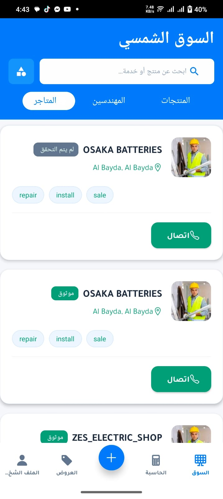
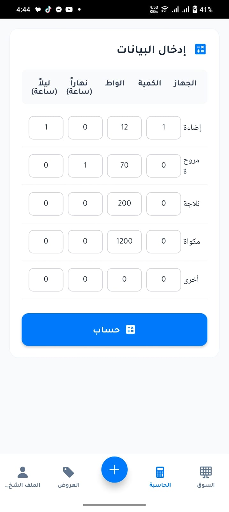

# Qafzh Mobile Final 🚀

A fully responsive **React Native Expo** app built for [Qafzh Solar](https://qafzhsolar.com) — designed with performance and scalability in mind. 🌞📱

---

## 📸 App Screenshots

<table>
  <tr>
    <td align="center">
      
    </td>
    <td align="center">
      
    </td>
  </tr>
  <tr>
    <td align="center">
      
    </td>
    <td align="center">
      
    </td>
  </tr>
  <tr>
    <td align="center">
      
    </td>
    <td align="center">
      
    </td>
  </tr>
  <tr>
    <td align="center">
      
    </td>
    <td align="center">
      
    </td>
  </tr>
</table>

---

## ⚙️ Features

- 🔐 User Authentication (Login / Signup)
- 📦 Redux State Management
- 🌐 API Integration (Express + MongoDB backend)
- 📱 Responsive Layout for Android
- ☁️ Cloudinary image uploads
- 🔔 Push Notifications (optional)

---

## 🛠️ Tech Stack

- React Native (Expo)
- Redux
- React Navigation
- Axios
- Cloudinary
- Express.js
- MongoDB

---

## 🚀 Getting Started

```bash
git clone https://github.com/HafizBasit7/Qafzh_Mobile_Final.git
cd Qafzh_Mobile_Final
npm install
npx expo start
